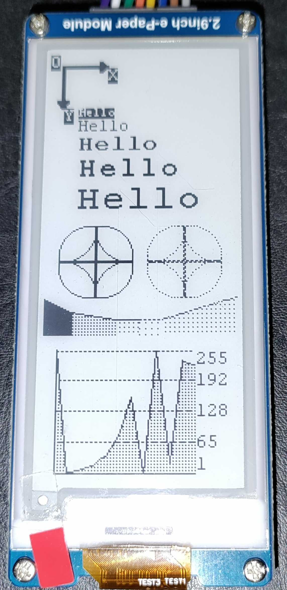

# Waveshare Screen Tools
## Introduction

This project is a list of reusable objects for waveshare screen and for esp32 cards it is based on the code provided by [waveshare](https://www.waveshare.com/wiki/E-Paper_ESP32_Driver_Board). 

Tested with the 2in9_V2

## Installation
This project uses [platformio](https://platformio.org/)
Pin definition is done in [DEV_Config.h](./src/DEV_Config.h). 

|code|PIN|shield|
| - | - | - |
|BUSY |25| BUSY	
|RST  |26| RST	
|DC   |27| DC	
|CS   |15| CS	
|SCK  |13| SCK	
|MOSI |16| DIN	
|||VCC	
|||GND	

To change the debug mode in you have to delete "-DUSE_DEBUG=1" platformio.ini

## functionality add
TODO 

## hexa_to_din.ex ?? 
tools for making icon (don't use)